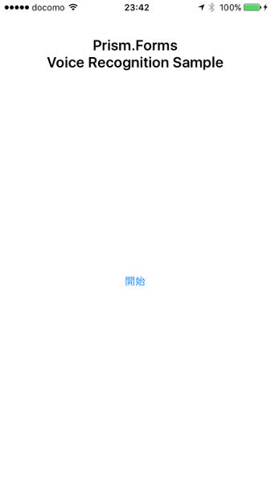
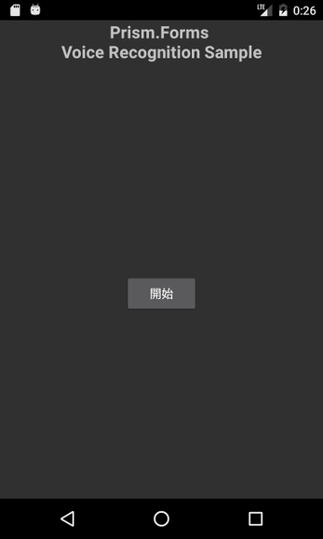
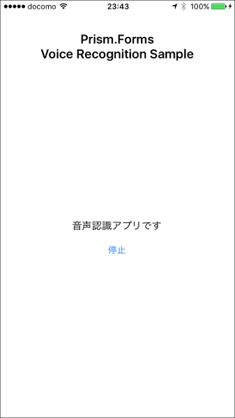
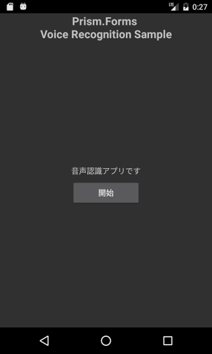

# VoiceRecognitionSample
Prism for Xamarin.Forms（Prism.Forms）で作成した、音声認識のサンプルアプリです。

## 対応プラットフォーム
- iOS（バージョン10.0以上）
- Android

## 機能
音声を認識し、画面上に認識結果の文章を表示します。

## 画面ショット

#### 音声認識実行前
|iOS|Android|
|---|---|
|||
開始ボタンを押下した後に音声を吹き込むと、その音声の認識結果が画面上に表示されます。

#### 音声認識実行後
認識結果は開始/停止ボタンの真上に表示されます。

|iOS|Android|
|---|---|
|||

## 注意・免責
- どちらのプラットフォームでも、音声認識を使用する際はインターネットへの接続が必須です。
- [iOSの場合、端末ごと・アプリごとに音声認識処理の使用回数等に制限があります。](http://qiita.com/nerd0geek1/items/af9f0555c3f6c8d878eb)
- 本アプリの利用は自己責任でお願いします。
